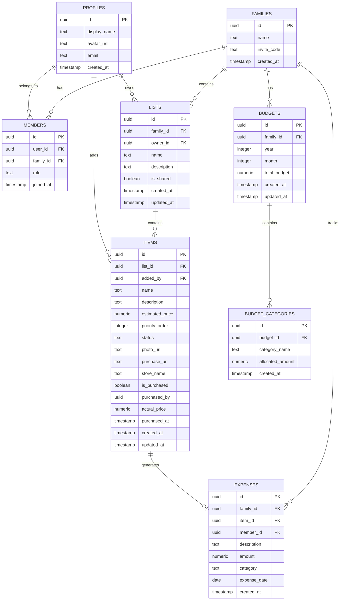
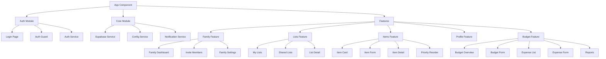
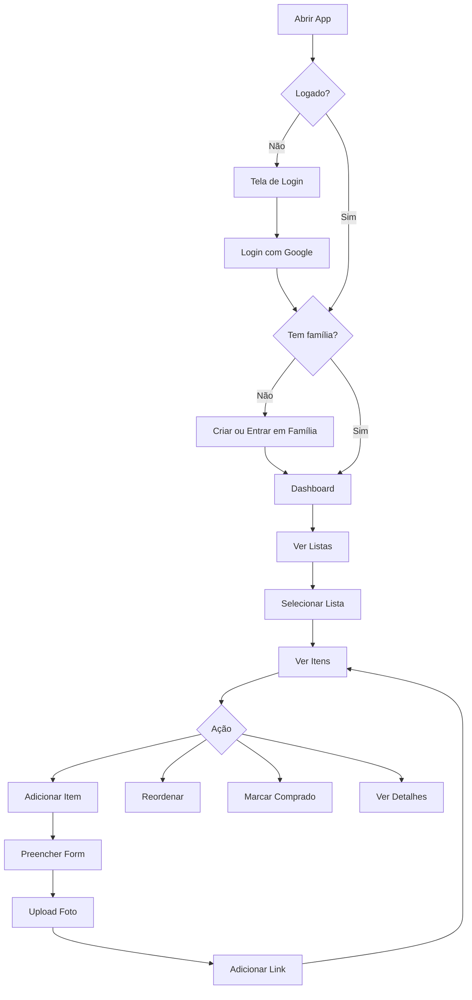

# Family Purchase List - Arquitetura e Plano

## 📋 Visão Geral

Aplicativo PWA para controle de gastos em família, onde cada membro possui sua própria lista de compras com prioridades, fotos e links de onde comprar.

---

## 🛠️ Stack Tecnológica

### Frontend: **Angular 19 + Angular Material**

**Por quê Angular?**
- Suporte nativo a PWA via `@angular/pwa` - gera Service Worker e manifest automaticamente
- Angular Material oferece componentes mobile-first prontos (listas, cards, drag-and-drop)
- Standalone components simplificam a arquitetura
- Signals para reatividade moderna e performática
- Angular CDK para drag-and-drop nativo

### Backend: **Supabase**

**Por quê Supabase?**
- Tier gratuito generoso: 500MB banco, 1GB storage, 50k auth users
- PostgreSQL completo com Row Level Security (RLS) - segurança no nível do banco
- Auth com Google OAuth integrado
- Storage para upload de fotos
- Realtime subscriptions - atualizações em tempo real entre membros
- SDK JavaScript oficial

### UI Framework: **Angular Material + CDK**

**Por quê?**
- Componentes prontos para mobile: bottom sheets, cards, lists, FAB buttons
- CDK DragDrop para reordenar prioridades
- Theming customizável
- Acessibilidade built-in

### Deploy: **Vercel ou Netlify**

- Deploy gratuito para projetos pessoais
- HTTPS automático (necessário para PWA)
- CI/CD integrado com GitHub

---

## 🗄️ Modelo de Dados



### Tabelas SQL

| Tabela | Descrição |
|--------|-----------|
| `profiles` | Perfil do usuário (sincronizado com auth.users) |
| `families` | Grupo familiar com código de convite |
| `members` | Relação N:N entre profiles e families |
| `lists` | Listas de compras (pessoal ou compartilhada) |
| `items` | Itens da lista com prioridade, foto e link |
| `budgets` | Orçamento mensal da família |
| `budget_categories` | Categorias do orçamento com valor alocado |
| `expenses` | Gastos registrados, vinculados ou não a itens de lista |

### Status dos Itens
- `pending` - Aguardando compra
- `in_cart` - No carrinho (alguém vai comprar)
- `purchased` - Comprado
- `cancelled` - Cancelado

---

## 🏗️ Arquitetura do Frontend



### Estrutura de Diretórios

```
src/
├── app/
│   ├── core/
│   │   ├── services/
│   │   │   ├── supabase.service.ts
│   │   │   ├── auth.service.ts
│   │   │   ├── config.service.ts
│   │   │   └── notification.service.ts
│   │   ├── guards/
│   │   │   └── auth.guard.ts
│   │   ├── interceptors/
│   │   └── models/
│   │       ├── family.model.ts
│   │       ├── member.model.ts
│   │       ├── list.model.ts
│   │       ├── item.model.ts
│   │       ├── budget.model.ts
│   │       └── expense.model.ts
│   ├── features/
│   │   ├── auth/
│   │   │   ├── login/
│   │   │   │   └── login.component.ts
│   │   │   └── callback/
│   │   │       └── callback.component.ts
│   │   ├── family/
│   │   │   ├── dashboard/
│   │   │   │   └── family-dashboard.component.ts
│   │   │   ├── invite/
│   │   │   │   └── invite-member.component.ts
│   │   │   └── services/
│   │   │       └── family.service.ts
│   │   ├── lists/
│   │   │   ├── list-overview/
│   │   │   │   └── list-overview.component.ts
│   │   │   ├── list-detail/
│   │   │   │   └── list-detail.component.ts
│   │   │   └── services/
│   │   │       └── list.service.ts
│   │   ├── items/
│   │   │   ├── item-card/
│   │   │   │   └── item-card.component.ts
│   │   │   ├── item-form/
│   │   │   │   └── item-form.component.ts
│   │   │   ├── item-detail/
│   │   │   │   └── item-detail.component.ts
│   │   │   └── services/
│   │   │       └── item.service.ts
│   │   ├── budget/
│   │   │   ├── budget-overview/
│   │   │   │   └── budget-overview.component.ts
│   │   │   ├── budget-form/
│   │   │   │   └── budget-form.component.ts
│   │   │   ├── expense-list/
│   │   │   │   └── expense-list.component.ts
│   │   │   ├── expense-form/
│   │   │   │   └── expense-form.component.ts
│   │   │   ├── reports/
│   │   │   │   └── budget-reports.component.ts
│   │   │   └── services/
│   │   │       ├── budget.service.ts
│   │   │       └── expense.service.ts
│   │   └── profile/
│   │       └── profile.component.ts
│   ├── shared/
│   │   ├── components/
│   │   │   ├── bottom-nav/
│   │   │   ├── header/
│   │   │   └── empty-state/
│   │   └── pipes/
│   │       └── currency.pipe.ts
│   ├── app.component.ts
│   ├── app.config.ts
│   └── app.routes.ts
├── assets/
│   ├── icons/
│   └── config.json
├── environments/
│   ├── environment.ts
│   └── environment.prod.ts
├── manifest.webmanifest
└── index.html
```

---

## 🔐 Segurança - Row Level Security

Cada tabela terá políticas RLS no Supabase:

- **profiles**: Usuário só edita seu próprio perfil
- **families**: Apenas membros podem ver/editar a família
- **members**: Apenas admin da família pode adicionar/remover membros
- **lists**: Membros da família podem ver; dono pode editar
- **items**: Membros da família podem ver; dono da lista pode editar
- **budgets**: Membros da família podem ver; admin pode criar/editar
- **budget_categories**: Mesma política do budget pai
- **expenses**: Membros podem criar; admin pode editar/deletar qualquer uma

---

## 📱 Funcionalidades PWA

1. **Instalável** - Manifest com ícones, splash screen, tema
2. **Offline** - Service Worker com cache de assets e dados
3. **Responsivo** - Layout mobile-first com Angular Material
4. **Notificações** - Push notifications quando item for comprado (futuro)

---

## 🎨 Telas Principais

### 1. Login
- Botão "Entrar com Google"
- Logo e nome do app

### 2. Dashboard da Família
- Lista de membros
- Resumo de gastos
- Acesso rápido às listas

### 3. Minhas Listas
- Cards com nome da lista e quantidade de itens
- FAB para criar nova lista
- Filtro: Minhas / Compartilhadas

### 4. Detalhe da Lista
- Itens ordenados por prioridade
- Drag-and-drop para reordenar
- Swipe para marcar como comprado
- FAB para adicionar item

### 5. Formulário de Item
- Nome do item
- Descrição
- Preço estimado
- Foto (câmera ou galeria)
- Link de onde comprar
- Nome da loja
- Prioridade

### 6. Detalhe do Item
- Foto em destaque
- Informações completas
- Botão para abrir link da loja
- Botão para marcar como comprado

### 7. Orçamento Mensal
- Valor total do orçamento do mês
- Categorias com valor alocado vs gasto
- Barra de progresso por categoria
- Gráfico de pizza com distribuição

### 8. Registro de Gastos
- Lista de gastos do mês com filtros
- Formulário para adicionar gasto manual
- Vinculação automática quando item é marcado como comprado
- Preço real vs estimado

### 9. Relatórios
- Gastos por mês (gráfico de barras)
- Gastos por categoria
- Gastos por membro da família
- Comparativo orçado vs realizado

---

## 🔄 Fluxo Principal



---

## ⚙️ Configurações (config.json)

```json
{
  "app": {
    "name": "Family Purchase List",
    "version": "1.0.0",
    "defaultCurrency": "BRL",
    "maxPhotoSizeMB": 5,
    "maxItemsPerList": 100,
    "maxListsPerFamily": 50
  },
  "supabase": {
    "url": "SUPABASE_URL",
    "anonKey": "SUPABASE_ANONKEY"
  },
  "features": {
    "enableNotifications": false,
    "enableOfflineMode": true,
    "enableSharedLists": true,
    "enablePhotoUpload": true,
    "enableBudget": true,
    "enableReports": true
  },
  "budget": {
    "defaultCategories": [
      "Alimentação",
      "Casa",
      "Transporte",
      "Saúde",
      "Educação",
      "Lazer",
      "Vestuário",
      "Outros"
    ]
  },
  "ui": {
    "theme": "light",
    "primaryColor": "#3F51B5",
    "accentColor": "#FF4081",
    "itemsPerPage": 20
  }
}
```

---

## 📦 Dependências Principais

| Pacote | Versão | Uso |
|--------|--------|-----|
| `@angular/core` | ^19 | Framework principal |
| `@angular/pwa` | ^19 | Service Worker + Manifest |
| `@angular/material` | ^19 | Componentes UI |
| `@angular/cdk` | ^19 | Drag-and-drop, overlays |
| `@supabase/supabase-js` | ^2 | SDK do Supabase |
| `compressorjs` | ^1 | Compressão de imagens antes do upload |
| `chart.js` | ^4 | Gráficos para relatórios de orçamento |
| `ng2-charts` | ^6 | Wrapper Angular para Chart.js |

---

## 🚀 Ordem de Implementação

1. **Setup** - Criar projeto Angular, configurar PWA, instalar dependências
2. **Supabase** - Criar projeto, tabelas, RLS, configurar Auth Google
3. **Auth** - Login/logout com Google, guard de rotas
4. **Família** - CRUD de família, convite por código
5. **Listas** - CRUD de listas, visualização
6. **Itens** - CRUD de itens, prioridade, drag-and-drop
7. **Fotos** - Upload para Supabase Storage, compressão
8. **Links** - Campo de URL com preview da loja
9. **Orçamento** - CRUD de orçamento mensal, categorias
10. **Gastos** - Registro de gastos, vinculação com itens comprados
11. **Relatórios** - Gráficos e comparativos de gastos
12. **PWA** - Ícones, splash, cache offline
13. **Testes** - Unitários para services e components
14. **Deploy** - Configurar CI/CD e deploy
